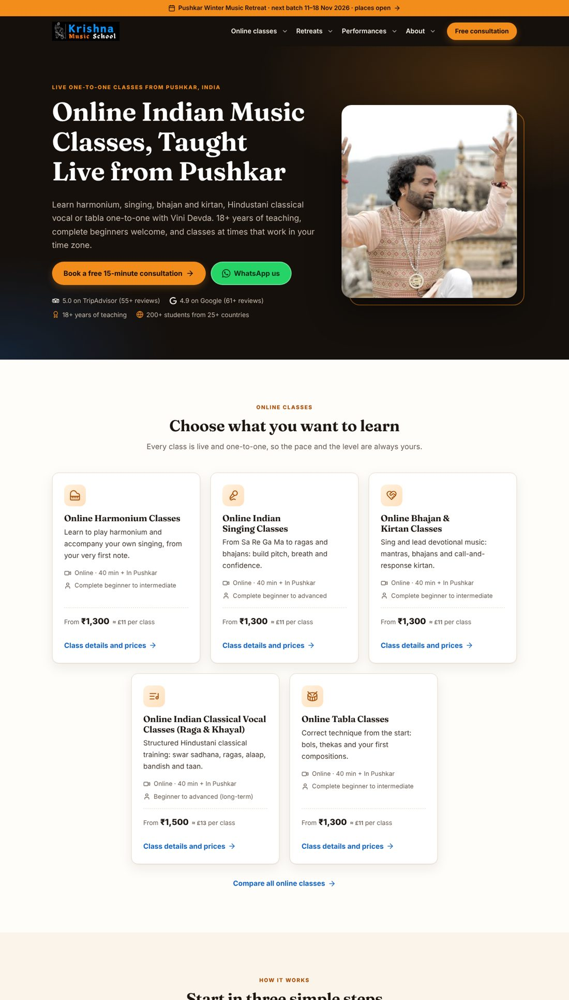
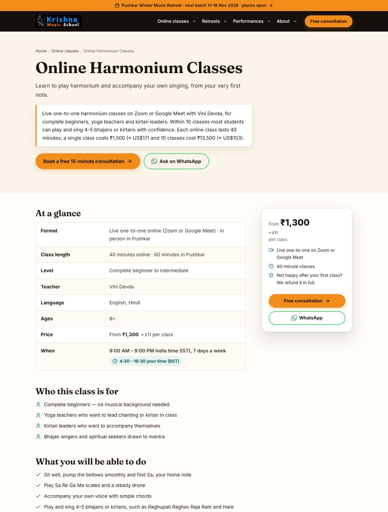
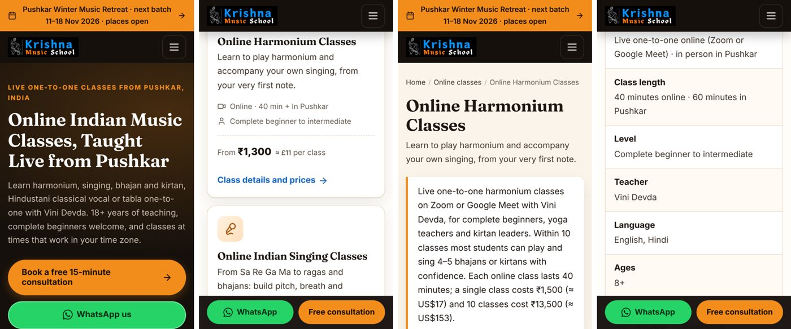

# Krishna Music School: site audit and new WordPress theme

A rebuild of **krishnamusicschool.com** aimed at one goal: **more enrolments in live online classes**. It does this by fixing the SEO errors, making the site's facts consistent, and making the school easy for Google and AI assistants to recommend.

| | |
|---|---|
| 📋 **Audit** | [`docs/01-AUDIT-REPORT.md`](docs/01-AUDIT-REPORT.md): every error and SEO problem found on the live site (Oct 2026), with evidence, plus per-URL findings |
| ✅ **Facts to confirm** | [`docs/02-FACTS-TO-CONFIRM.md`](docs/02-FACTS-TO-CONFIRM.md): the live site contradicts itself on prices, founding year, founder's name and postcode. The school must pick one value for each |
| 🛠 **Install and migration** | [`docs/03-INSTALL-AND-MIGRATION.md`](docs/03-INSTALL-AND-MIGRATION.md): staging → facts → import → theme → clean-up → Hostinger → go-live checklist |
| 🧭 **Content and AI plan** | [`docs/04-CONTENT-AND-AI-PLAN.md`](docs/04-CONTENT-AND-AI-PLAN.md): structure, titles and meta, blog merges, getting recommended by AI assistants, measurement, 90-day plan |
| ↪️ **Redirects** | [`docs/redirects.htaccess`](docs/redirects.htaccess) · [`docs/redirects.csv`](docs/redirects.csv) |

## What's in the code

```
wp-content/
├── themes/kms-theme/      Presentation: templates, CSS (8 KB compressed), JS (1.4 KB), one self-hosted font
└── plugins/kms-core/      Data and logic, kept out of the theme so content survives a theme change
```

**KMS Core (plugin)**
- **Settings → KMS Facts**: one registry for every business fact (name, founder, address, prices, hours, ratings, retreat dates, profiles). Pages, structured data and `llms.txt` all read from it, plus a **Run checks** panel.
- **Classes** (`/online-classes/…`), **Reviews** (each with a "verified" flag and source link), **FAQs** (grouped) and **Enquiries** (private, CSV export, GDPR export/erase).
- **Enquiry form**: saved in WordPress and emailed, with a WhatsApp hand-off. Works on cached pages (no nonce) with honeypot, time-trap and rate-limit spam protection. Asks "How did you find us?", which includes "AI assistant".
- **Structured data**: one connected JSON-LD graph per page (Organization + LocalBusiness, founder Person, Course + Offers, EducationEvent, FAQPage, BreadcrumbList, BlogPosting). Replaces Rank Math/Yoast JSON-LD and removes old JSON-LD pasted into content, including the fake ratings.
- **AI engines**: `/llms.txt` generated from live data, and AI crawlers explicitly allowed in `robots.txt`.
- **Divi fallback**: old Divi pages keep rendering after the theme switch.
- Starter content written only from facts on the current site (5 classes, ~30 FAQs, 10 TripAdvisor reviews, Pricing/FAQ/Refund/About/Reviews/Contact pages). Run it from **Tools → KMS Starter Content** or `wp kms import`.
- Shortcodes for editors: `[kms_courses]` `[kms_pricing]` `[kms_reviews]` `[kms_faqs]` `[kms_facts]` `[kms_steps]` `[kms_includes]` `[kms_founder]` `[kms_retreats]` `[kms_timezone]` `[kms_contact]` `[kms_trust]` `[kms_whatsapp]` `[kms_button]` `[kms_enquiry_form]` `[kms_review_links]`.

**Krishna Music School (theme)**
- Homepage built around online enrolment; the `/online-classes/` hub; class pages that open with a short answer and an "At a glance" table, a sticky enrol card, prices, FAQ and the form.
- Prices in ₹ with approximate US$/€/£ picked from the visitor's time zone (switchable); class hours shown in the visitor's own time zone.
- One H1 per page, breadcrumbs, a real 404 page, a named author and dates on posts, and a class recommendation at the end of each post.
- No page builder and no jQuery; WCAG 2.1 AA (axe-core: 0 violations); mobile sticky WhatsApp/consultation bar.

## Build the upload zips

```sh
bin/build.sh          # → dist/kms-theme.zip, dist/kms-core.zip
```

## Tests

`tests/` holds the scripts used to check the build against a local WordPress (SQLite, PHP built-in server):

```sh
tests/local-wp.sh     # downloads WordPress + WP-CLI, installs, links the theme/plugin, imports sample content, serves on :8080
node tests/e2e.js     # enquiry form (fetch + no-JS), currency switch, time zones, mobile menu, sticky bar, skip link
node tests/axe.js     # accessibility (WCAG 2.1 AA) on key pages, desktop + mobile
python3 tests/schema_check.py   # one valid JSON-LD graph per page type, required properties, no ratings, no placeholders
```

Requirements: WordPress 6.4+ (tested on 7.1.3), PHP 7.4+ (tested on 8.3), Rank Math optional (tested with 1.0.280).

## Screenshots

| New homepage | New class page | Mobile |
|---|---|---|
|  |  |  |
